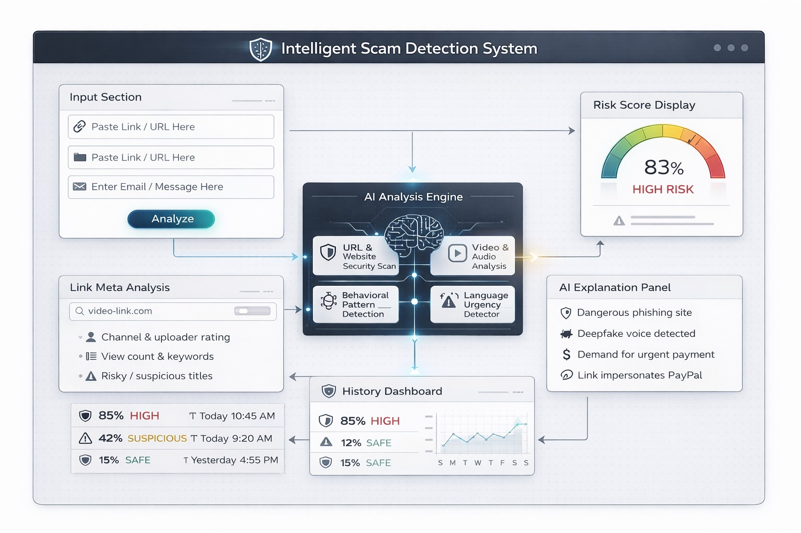

# BWT_TechDevops: Saenix AI ⚡

> **Intercept Before Impact.**
> A Psychological Threat Intelligence Engine that detects manipulation intent, not just malicious code.

 

## 🚨 Problem Statement
Online scams are evolving rapidly, exploiting behavioral patterns, emotional manipulation, and contextual loopholes. Traditional rule-based security systems are becoming ineffective because they focus on technical payloads (malware signatures, blacklisted IPs). Modern threat actors bypass these filters using **Social Engineering**—manipulating human psychology through fear, urgency, and false authority. 

**Current systems cannot parse human intent.**

## 🛡️ The Solution: Saenix AI
Saenix AI introduces the **Threat Genome Framework**. Instead of scanning for bad code, Saenix utilizes NLP and heuristics to analyze the psychological pressure points of any communication (Text, Email, URL) in real-time.

### Core Intelligence Engines:
1.  **Emotional Manipulation Engine:** Maps text against dictionaries for Fear, Urgency, Authority, and Reward/Greed.
2.  **Intent Classification Engine:** Categorizes the core objective of the attacker (e.g., Credential Harvesting, Financial Extraction).
3.  **Domain Intelligence Engine:** Statically analyzes URLs for typosquatting, suspicious TLDs, and obfuscated origins.
4.  **Risk Aggregator:** Synthesizes the sub-vectors into a final, highly accurate 0-100 Threat Score and human-readable AI Summary.

## 🏗 Architecture
The system consists of a frontend dashboard, an AI-based scam detection engine, and an alert mechanism to protect users in real time.


## 🛠 Tech Stack
*   **Frontend:** Vanilla JS, HTML5, Vanilla CSS (Custom Design System, Zero Frameworks)
*   **Backend:** Node.js, Express.js
*   **Detection Tier:** Custom Heuristics & Pattern Recognition Modules
*   **Database:** MongoDB (History & Analytics Logging)

## 🚀 How to Run Locally

1.  **Clone the repository**
2.  **Install Dependencies:**
    ```bash
    npm install
    ```
3.  **Start the Database:** Ensure MongoDB is running locally on port `27017`. *(Note: The app degrades gracefully and functions without DB if necessary).*
4.  **Start the Intelligence Server:**
    ```bash
    node server.js
    ```
5.  **Access the Dashboard:** Open your browser and navigate to `http://localhost:5000`

## 🧠 The Algorithm
For a deep dive into the mathematical weighting and logic equations powering Saenix AI, please review `algorithm.md` in the root directory.

---
*Built for the 2026 BWT TechDevops Hackathon.*
